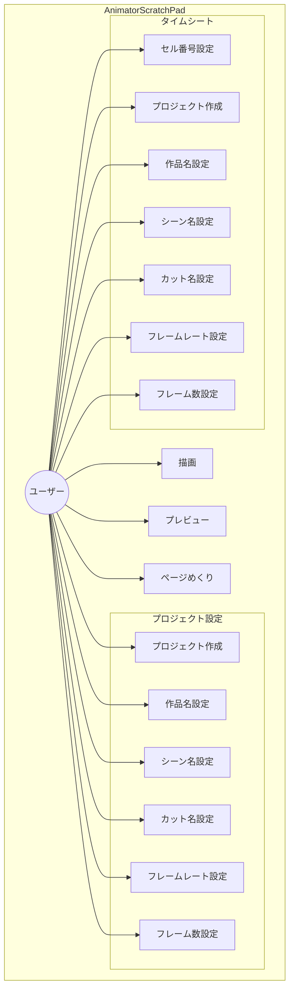

```mermaid
graph TB
    subgraph "AnimatorScratchPad"
        User((ユーザー))
        subgraph "プロジェクト設定"
          makeProject[プロジェクト作成]
          productNameSetting[作品名設定]
          sceneNameSetting[シーン名設定]
          cutNameSetting[カット名設定]
          durationSetting[フレームレート設定]
          leadtimeSetting[フレーム数設定]
        end

        subgraph "タイムシート"
          cellSetting[セル番号設定]

          t_makeProject[プロジェクト作成]
          t_productNameSetting[作品名設定]
          t_sceneNameSetting[シーン名設定]
          t_cutNameSetting[カット名設定]
          t_durationSetting[フレームレート設定]
          t_leadtimeSetting[フレーム数設定]
        end

        drawing[描画]
        preview[プレビュー]
        scroll[ページめくり]
    end
    User --> makeProject
    User --> productNameSetting
    User --> sceneNameSetting
    User --> cutNameSetting
    User --> durationSetting
    User --> leadtimeSetting

    User --> cellSetting
    User --> drawing
    User --> preview
    User --> scroll

    User --> t_makeProject
    User --> t_productNameSetting
    User --> t_sceneNameSetting
    User --> t_cutNameSetting
    User --> t_durationSetting
    User --> t_leadtimeSetting
```
